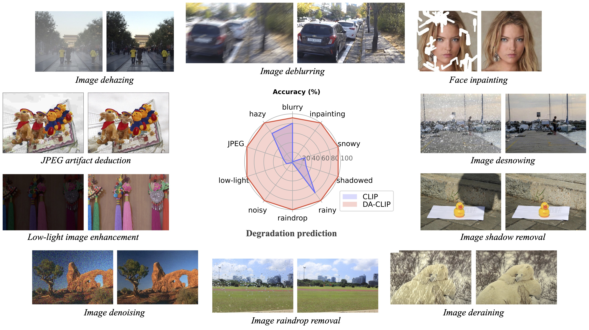

# Controlling Vision-Language Models for Universal Image Restoration <br><sub>Deploy DA-CLIP running on Windows. </sub>

### Original project

> [Project Page](https://algolzw.github.io/daclip-uir) | [Paper](https://arxiv.org/abs/2310.01018) | [Model Card 🤗](https://huggingface.co/weblzw/daclip-uir-ViT-B-32-irsde) | [Open In Colab](https://colab.research.google.com/github/camenduru/daclip-uir-colab/blob/main/daclip_uir_gradio_colab.ipynb)
> [](https://huggingface.co/spaces/fffiloni/DA-CLIP) 
> [](https://replicate.com/cjwbw/daclip-uir) 
>
> 
>

### Updates

[*2024.05.0*9]  update the daclip-IRS code and instructions.

## Introduction to this Project

The current project has not made any adjustments to the original project's restoration model structure or reselected datasets for training and testing. Instead, it has modified and perfected the interface and functionalities to fulfill the undergraduate graduation project design requirements. The following interface code functionalities are provided for understanding and expanding the project:

- `detect_clip.py` and `detect_daclip.py` are interfaces for degeneration type detection using CLIP and DA-CLIP, respectively. Relevant articles for reference can be found at http://t.csdnimg.cn/U0zLM and http://t.csdnimg.cn/zl2Ei.
- `interface_v1.py` and `interface_v2.py` are restoration functionalities developed according to the requirements of the undergraduate thesis. They include automatic detection results and manual selection of the desired degeneration type. The manual selection detection approach replaces the Degradation Embedding from Image-controller with Degradation Embedding from Text-encoder. The difference in v2 is that when the manually selected result matches the maximum value of the automatic detection result, the Degradation Embedding from Image-controller is used to achieve the best restoration effect.

- `testsingle.py` provides calculations for PSNR, SSIM, and LPIPS for a single image, referencing `test.py`.

### Dependencies

* OS: win11
* nvidia:
  - cuda: 12.1
* python 3.9

The project requirements specify Python 3.9 because when exporting related dependencies with pipreqs, it failed to correctly identify packages that were present in the local environment and packages that were imported but not actually used, which were then set to the latest version upon querying PIP. The requirements have been tested and confirmed to be operational on the local machine. The dependencies for this project only include those necessary for running and testing, excluding those related to training. 

Python 3.8 is also acceptable; you can use the requirements from the original project, but note that it is not necessary to install all the cudnn11-related dependencies listed. The versions of cudnn, the CUDA toolkit, and pytorch-gpu should be installed based on the individual's local environment setup.

This project has only 16 dependencies compared to the original project's 60 dependencies

### Install

If anaconda3 is used I advise you first create a virtual environment with:

```bash
conda create --name daclip-ISR python=3.9 

conda activate daclip-ISR 

cd yourprojdir

pip install -r requirements.txt
```

Install pytorch for your gpu

for me:

```bash
pip install torch==2.2.1+cu121 -f https://download.pytorch.org/whl/torch_stable.html
pip install torchvision==0.17.1+cu121 -f https://download.pytorch.org/whl/torch_stable.html
```

#### Pretrained Models

DA-CLIP and Universal-IR are downloaded in pairs, otherwise it does not work as well.

| Model Name       | Description                                                 | GoogleDrive                                                  | HuggingFace                                                  |
| ---------------- | ----------------------------------------------------------- | ------------------------------------------------------------ | ------------------------------------------------------------ |
| DA-CLIP          | 退化感知CLIP模型                                            | [download](https://drive.google.com/file/d/1A6u4CaVrcpcZckGUNzEXqMF8x_JXsZdX/view?usp=sharing) | [download](https://huggingface.co/weblzw/daclip-uir-ViT-B-32-irsde/blob/main/daclip_ViT-B-32.pt) |
| Universal-IR     | 基于DA-CLIP的通用图像恢复模型                               | [download](https://drive.google.com/file/d/1eXsyrmAbWOvhIY4Wbt5v4IxaggA5aZMG/view?usp=sharing) | [download](https://huggingface.co/weblzw/daclip-uir-ViT-B-32-irsde/blob/main/universal-ir.pth) |
| DA-CLIP-mix      | 退化感知CLIP模型(添加高斯模糊+面部修复和高斯模糊+ 图像去雨) | [download](https://drive.google.com/file/d/12KZK9Apx74pU23OGG9YSybd6gzN_PuGU/view?usp=sharing) | [download](https://huggingface.co/weblzw/daclip-uir-ViT-B-32-irsde/blob/main/daclip_ViT-B-32_mix.pt) |
| Universal-IR-mix | 基于DA-CLIP的通用图像恢复模型(添加鲁棒训练和混合退化)       | [download](https://drive.google.com/file/d/1HRgsEUCw4_m6CC_XYpJGHNjuIMd1jAcm/view?usp=sharing) | [download](https://huggingface.co/weblzw/daclip-uir-ViT-B-32-irsde/blob/main/universal-ir-mix.pth) |

### Evaluation

To evalute our method on image restoration, please modify the benchmark path and model path and run


> ### Gradio
>
> Here we provide an [app.py](https://github.com/Algolzw/daclip-uir/tree/main/universal-image-restoration/config/daclip-sde/app.py) file for testing your own images. Before that, you need to download the pretrained weights ([DA-CLIP](https://drive.google.com/file/d/1A6u4CaVrcpcZckGUNzEXqMF8x_JXsZdX/view?usp=sharing) and [UIR](https://drive.google.com/file/d/1eXsyrmAbWOvhIY4Wbt5v4IxaggA5aZMG/view?usp=sharing)) and modify the model path in `options/test.yml`. Then by simply running `python app.py`, you can open `http://localhost:7860` to test the model. (We also provide several images with different degradations in the `images` dir). We also provide more examples from our test dataset in the [google drive](https://drive.google.com/file/d/1C1nmP5kJXzxrULxTMVWF5P30qezqP6kn/view?usp=sharing).
>

### Contact

If you have any inquiries, please feel free to reach out to the author of the daclip project at [ziwei.luo@it.uu.se](mailto:ziwei.luo@it.uu.se), or alternatively, you may contact the author of this project at [liyangh123@gmail.com](mailto:liyangh123@gmail.com).

> ### Citations
>
> Ifcode helps your research or work, please consider citing the paper.
> The following are BibTeX references:
>
> ```
> @article{luo2023controlling,
>   title={Controlling Vision-Language Models for Universal Image Restoration},
>   author={Luo, Ziwei and Gustafsson, Fredrik K and Zhao, Zheng and Sj{\"o}lund, Jens and Sch{\"o}n, Thomas B},
>   journal={arXiv preprint arXiv:2310.01018},
>   year={2023}
> }
> ```
>

